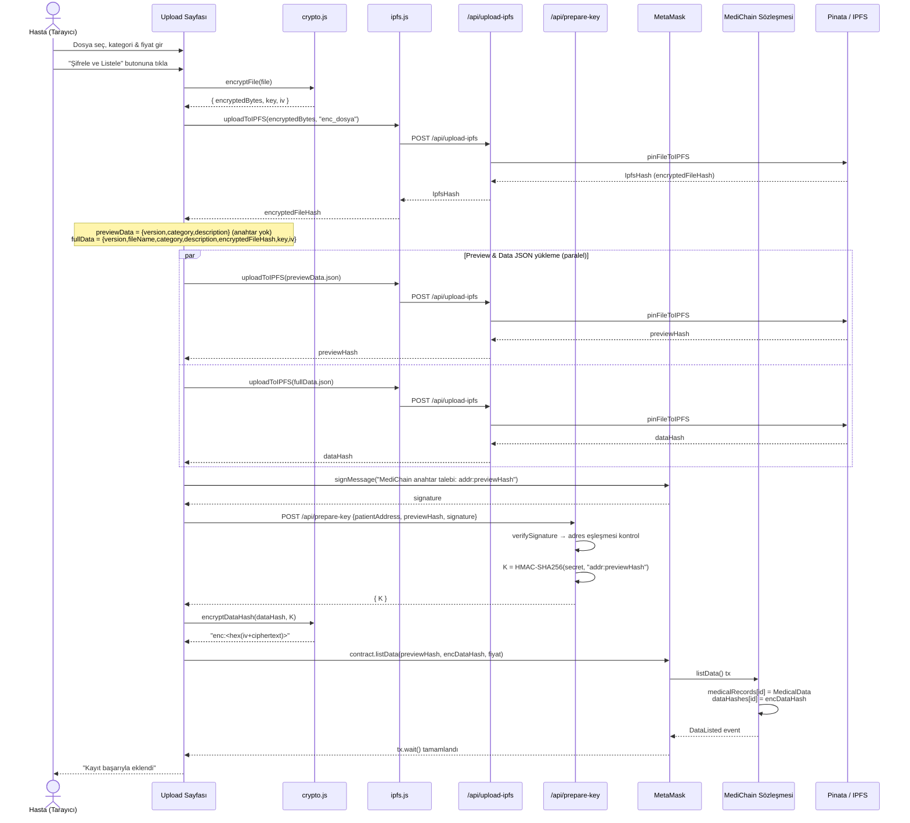
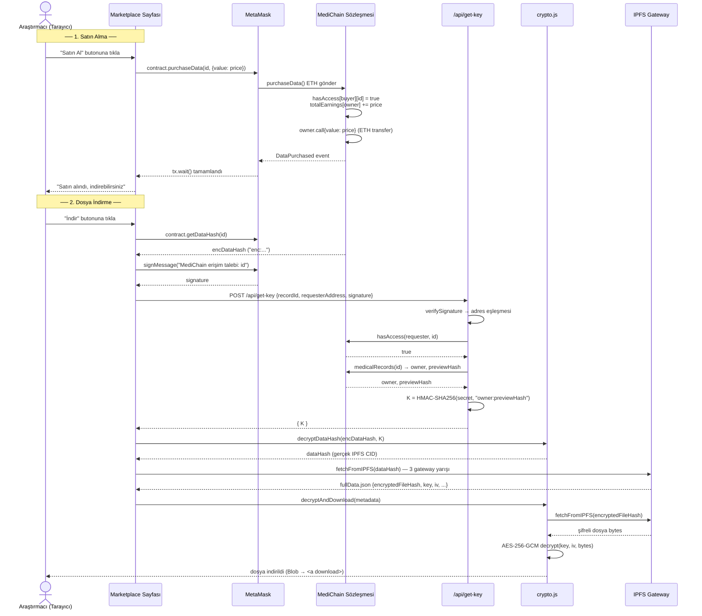
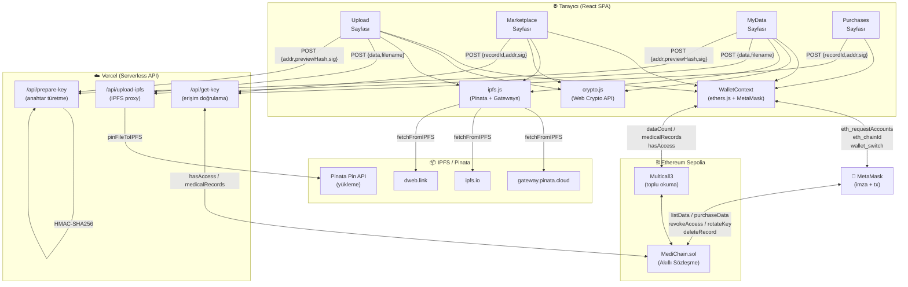
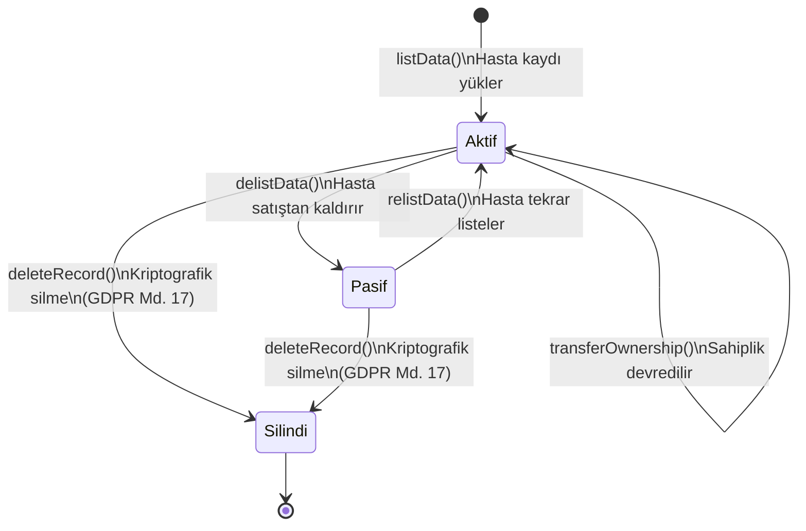
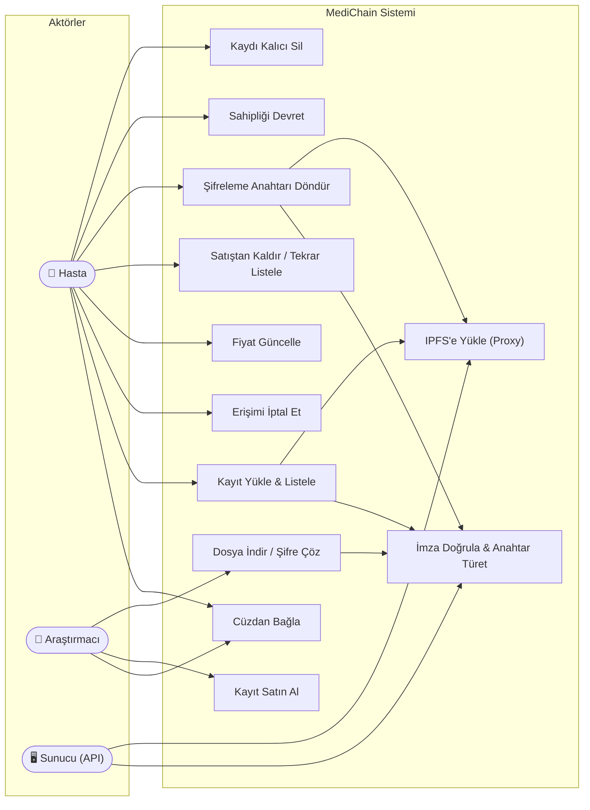

# MediChain — UML Diyagramları

---

## 1. Sınıf Diyagramı (Class Diagram)

```mermaid
classDiagram
    direction TB

    %% ── Smart Contract katmanı ──────────────────────────────────────
    class MediChain {
        <<Solidity Contract>>
        +uint256 dataCount
        +mapping medicalRecords
        -mapping dataHashes
        +mapping hasAccess
        +mapping totalEarnings
        +listData(previewHash, dataHash, price)
        +purchaseData(id) payable
        +revokeAccess(id, researcher)
        +delistData(id)
        +relistData(id)
        +updatePrice(id, newPrice)
        +transferRecordOwnership(id, newOwner)
        +rotateKey(id, newPreviewHash, newDataHash)
        +deleteRecord(id)
        +getDataHash(id) view
    }

    class MedicalData {
        <<struct>>
        +string previewHash
        +uint256 price
        +address payable owner
        +bool isActive
    }

    class ReentrancyGuard {
        <<OpenZeppelin>>
        #nonReentrant modifier
    }

    MediChain --> MedicalData : içerir
    MediChain --|> ReentrancyGuard : miras alır

    %% ── API / Serverless katmanı ────────────────────────────────────
    class PrepareKeyHandler {
        <<Vercel Serverless>>
        -KEY_DERIVATION_SECRET: string
        +POST(patientAddress, previewHash, signature) K: string
        -verifySignature(message, signature, address) bool
        -hmacSha256(secret, data) hex
    }

    class GetKeyHandler {
        <<Vercel Serverless>>
        -KEY_DERIVATION_SECRET: string
        -SEPOLIA_RPC_URL: string
        +POST(recordId, requesterAddress, signature) K: string
        -verifySignature(message, signature, address) bool
        -checkOnChainAccess(address, recordId) bool
        -hmacSha256(secret, ownerAddress+previewHash) hex
    }

    class UploadIPFSHandler {
        <<Vercel Serverless>>
        -PINATA_JWT: string
        +POST(data, filename, contentType) IpfsHash: string
    }

    %% ── Frontend — Context ──────────────────────────────────────────
    class WalletContext {
        <<React Context>>
        +account: string
        +contract: ethers.Contract
        +records: MedicalRecord[]
        +loadingRecords: bool
        +toasts: Toast[]
        +connectWallet()
        +loadRecords()
        +addToast(message, type, duration)
        +removeToast(id)
    }

    class MedicalRecord {
        <<DTO>>
        +id: number
        +previewHash: string
        +price: BigInt
        +owner: string
        +isActive: bool
        +userHasAccess: bool
    }

    WalletContext "1" o-- "0..*" MedicalRecord : tutar

    %% ── Frontend — Sayfalar ─────────────────────────────────────────
    class UploadPage {
        <<React Component>>
        -file: File
        -price: string
        -category: string
        -description: string
        -loading: bool
        -progress: number
        +uploadAndList()
        -selectFile(f)
        -reset()
    }

    class MarketplacePage {
        <<React Component>>
        -filter: string
        -sort: string
        -categoryFilter: string
        -metadata: Map
        +fetchAllMetadata(records)
        +purchaseRecord(id, price)
        +viewRecord(id)
    }

    class MyDataPage {
        <<React Component>>
        -expandedAccess: Map
        -purchasers: Map
        -priceInputs: Map
        +loadPurchasers(recordId)
        +revokeAccess(recordId, addr)
        +delistRecord(id)
        +relistRecord(id)
        +updatePrice(recordId)
        +transferOwnership(recordId)
        +triggerRotateKey(recordId)
        +deleteRecord(recordId)
    }

    class PurchasesPage {
        <<React Component>>
        +viewRecord(id)
    }

    class Header {
        <<React Component>>
        +connectWallet()
    }

    %% ── Frontend — Yardımcılar ──────────────────────────────────────
    class CryptoUtils {
        <<ES Module>>
        +encryptFile(file) encryptedBytes,key,iv
        +encryptDataHash(cid, Khex) encStr
        +decryptDataHash(encStr, Khex) cid
        +decryptAndDownload(metadata)
    }

    class IPFSUtils {
        <<ES Module>>
        +uploadToIPFS(bytes, filename, contentType) hash
        +fetchFromIPFS(hash) Response
        +ipfsUrl(hash) string
    }

    %% ── İlişkiler ───────────────────────────────────────────────────
    UploadPage    ..> WalletContext : useWallet()
    MarketplacePage ..> WalletContext : useWallet()
    MyDataPage    ..> WalletContext : useWallet()
    PurchasesPage ..> WalletContext : useWallet()
    Header        ..> WalletContext : useWallet()

    UploadPage    ..> CryptoUtils : şifreler
    UploadPage    ..> IPFSUtils   : yükler
    MarketplacePage ..> IPFSUtils : metadata çeker
    MarketplacePage ..> CryptoUtils : şifre çözer
    MyDataPage    ..> CryptoUtils : anahtar rotasyonu
    MyDataPage    ..> IPFSUtils   : yeniden yükler

    WalletContext ..> MediChain : ethers.Contract
    UploadPage    ..> PrepareKeyHandler : POST /api/prepare-key
    MyDataPage    ..> PrepareKeyHandler : POST /api/prepare-key
    MarketplacePage ..> GetKeyHandler   : POST /api/get-key
    PurchasesPage ..> GetKeyHandler     : POST /api/get-key
    UploadPage    ..> UploadIPFSHandler : POST /api/upload-ipfs
    IPFSUtils     ..> UploadIPFSHandler : POST /api/upload-ipfs

    GetKeyHandler ..> MediChain : hasAccess() + medicalRecords()
```

---

## 2. Sıralama Diyagramı — Kayıt Yükleme (Upload) Akışı

---

## 3. Sıralama Diyagramı — Satın Alma & Dosya İndirme Akışı

---

## 4. Bileşen / Mimari Diyagramı (Component Diagram)

---

## 5. Durum Diyagramı — Tıbbi Kayıt Yaşam Döngüsü

---

## 6. Kullanım Senaryosu Diyagramı (Use Case)

