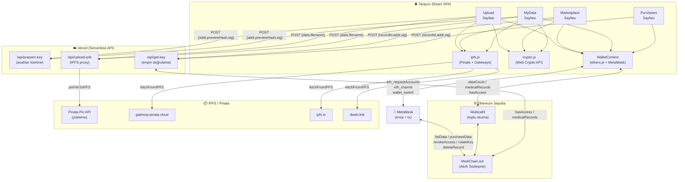
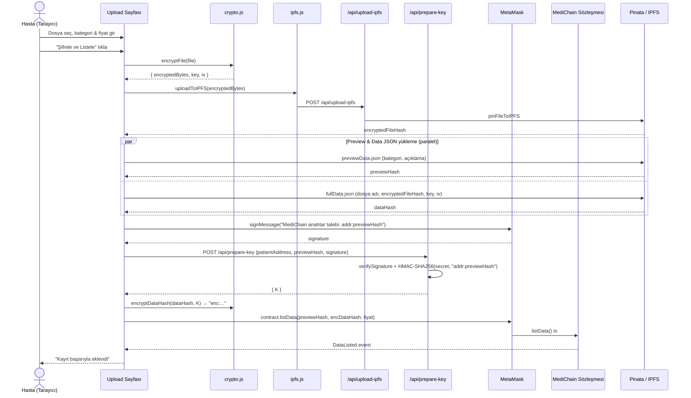
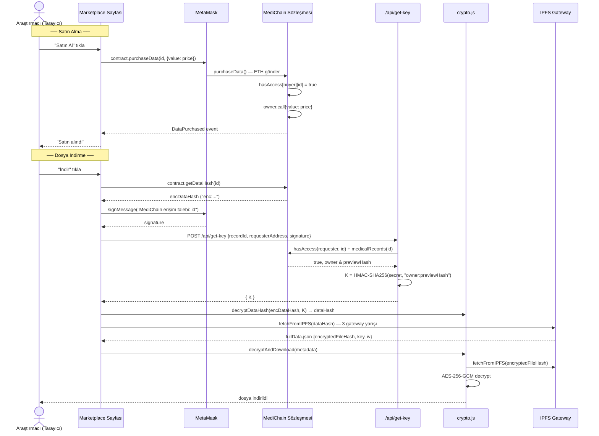
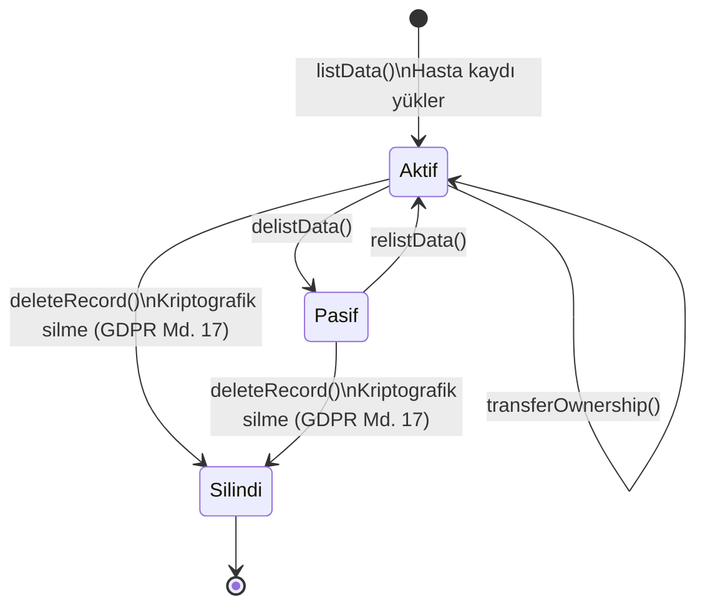

# MediChain — Merkeziyetsiz Tıbbi Veri Pazaryeri

Hastalar, tıbbi verilerini tarayıcıda **AES-256-GCM** ile şifreleyip IPFS'e yükleyebilir ve Ethereum akıllı sözleşmesi aracılığıyla araştırmacılara satabilir. Ödeme aracısız, doğrudan hasta cüzdanına aktarılır.

---

## Mimari

```
Tarayıcı (React + ethers.js)
    │
    ├── Web Crypto API → AES-256-GCM şifreleme (istemci tarafında)
    │
    ├── /api/upload-ipfs   (Vercel serverless) → Pinata → IPFS
    ├── /api/prepare-key   (Vercel serverless) → HMAC-SHA256 K türetme (yükleme)
    ├── /api/get-key       (Vercel serverless) → on-chain hasAccess + K (indirme)
    │
    ├── Multicall3 (0xcA11b…CA11) → tüm kayıt okumaları tek RPC round-trip
    ├── fetchFromIPFS → Pinata / ipfs.io / dweb.link gateway yarışı
    │
    └── MetaMask → MediChain.sol (Sepolia Testnet)
```

### İki Hash Güvenlik Mimarisi

Her kayıt IPFS'te **iki ayrı JSON** olarak saklanır:

| Dosya | İçerik | Erişim |
|-------|--------|--------|
| `preview.json` | `{ category, description }` | Herkese açık (pazar yeri önizlemesi) |
| `data.json` | `{ fileName, encryptedFileHash, key, iv }` | Yalnızca sahip veya alıcı |

Akıllı sözleşmede `previewHash` public mapping'de, `dataHash` private mapping'de tutulur. Şifre çözme anahtarı (`key`) yalnızca `getDataHash()` yetkisi olan kullanıcılara ulaşır.

### Veri Akışı (Yükleme)

1. Dosya tarayıcıda AES-256-GCM ile şifrelenir → `encryptedFileHash` IPFS'e yüklenir
2. `preview.json` ve `data.json` paralel olarak IPFS'e yüklenir (sunucu taraflı JWT ile)
3. `listData(previewHash, dataHash, price)` çağrısıyla her iki hash akıllı sözleşmeye kaydedilir

### Veri Akışı (Satın Alma & İndirme)

1. Araştırmacı `purchaseData(id)` çağırır → ETH doğrudan hasta cüzdanına aktarılır
2. `getDataHash(id)` ile `data.json` hash'i okunur (yalnızca `hasAccess = true` ise)
3. IPFS'ten `data.json` çekilir → şifre çözme anahtarı elde edilir
4. Şifreli dosya IPFS'ten indirilir, tarayıcıda çözülür ve yerel olarak kaydedilir

---

## UML Diyagramları

### Sistem Mimarisi (Bileşen Diyagramı)



### Kayıt Yükleme Akışı



### Satın Alma & İndirme Akışı



### Tıbbi Kayıt Yaşam Döngüsü



---

## Akıllı Sözleşme

**Ağ:** Sepolia Testnet  
**Adres:** `0x6f6b3AA1649093aBCA0fc1eC53909e4A5022A08C`  
**Explorer:** [sepolia.etherscan.io](https://sepolia.etherscan.io/address/0x6f6b3AA1649093aBCA0fc1eC53909e4A5022A08C)

### Fonksiyonlar

| Fonksiyon | Açıklama |
|-----------|----------|
| `listData(previewHash, dataHash, price)` | Yeni kayıt ekler; iki hash ve fiyatı kaydeder |
| `purchaseData(id)` | ETH ödeyerek kayda erişim hakkı satın alır |
| `getDataHash(id)` | Sahip veya alıcıya `data.json` hash'ini döner |
| `revokeAccess(id, researcher)` | Hasta, araştırmacının erişimini iptal eder |
| `delistData(id)` | Kaydı satıştan kaldırır |
| `relistData(id)` | Pasif kaydı tekrar aktif eder |
| `updatePrice(id, newPrice)` | Satış fiyatını günceller |
| `transferRecordOwnership(id, newOwner)` | Kaydın sahipliğini başka bir adrese devreder |
| `rotateKey(id, newPreviewHash, newDataHash)` | Şifre çözme anahtarını döndürür; eski araştırmacıların anahtarını geçersiz kılar |
| `deleteRecord(id)` | Kriptografik silme: hash'leri temizler, kaydı kalıcı olarak devre dışı bırakır (GDPR Art. 17) |

### Güvenlik

- **ReentrancyGuard** (OpenZeppelin) — `purchaseData` yeniden giriş saldırılarına karşı korumalı
- **CEI deseni** — state değişiklikleri ETH transferinden önce gerçekleşir
- **Private mapping** — `dataHashes` sözleşme ABI'sinde görünmez, yalnızca `getDataHash()` ile erişilir
- **Sahip koruması** — kullanıcı kendi kaydını satın alamaz

---

## Kurulum

### Gereksinimler

- Node.js 22+
- MetaMask tarayıcı eklentisi
- Sepolia testnet ETH ([sepoliafaucet.com](https://sepoliafaucet.com))
- Pinata hesabı ([pinata.cloud](https://pinata.cloud))

### Adımlar

```bash
# 1. Bağımlılıkları yükle
npm install
cd frontend && npm install && cd ..

# 2. Ortam değişkenlerini yapılandır
cp .env.example .env                        # SEPOLIA_RPC_URL, PRIVATE_KEY
cp frontend/.env.example frontend/.env     # VITE_PINATA_JWT (local dev)

# 3. Frontend'i başlat
cd frontend && npm run dev
```

Tarayıcıda `http://localhost:5173` adresini açın. MetaMask'ı **Sepolia** ağına bağlayın.

### Ortam Değişkenleri

**`frontend/.env`** (yerel geliştirme):

| Değişken | Zorunlu | Açıklama |
|----------|---------|----------|
| `VITE_PINATA_JWT` | Evet (local) | Pinata API JWT — yalnızca `npm run dev`'de kullanılır |
| `VITE_SEPOLIA_RPC_URL` | Hayır | Özel RPC URL; boş bırakılırsa Ankr public endpoint kullanılır |

**Vercel Dashboard → Settings → Environment Variables** (production):

| Değişken | Açıklama |
|----------|----------|
| `PINATA_JWT` | Sunucu taraflı Pinata JWT; istemciye hiç gönderilmez |
| `KEY_DERIVATION_SECRET` | Calldata şifrelemesi için HMAC anahtarı — `openssl rand -hex 32` ile üretin |
| `SEPOLIA_RPC_URL` | `/api/get-key`'in on-chain `hasAccess` doğrulaması için kullandığı RPC URL |

---

## Testler

```bash
npx hardhat test test/MediChain.ts
```

**51 test**, 10 grup:

| Grup | Test Sayısı |
|------|-------------|
| `listData` | 7 |
| `purchaseData` | 10 |
| `getDataHash` | 5 |
| `revokeAccess` | 4 |
| `delistData / relistData` | 6 |
| `updatePrice` | 4 |
| `transferRecordOwnership` | 5 |
| `totalEarnings` | 1 |
| `rotateKey` | 5 |
| `deleteRecord` | 4 |

CI her `push` ve `pull_request`'te otomatik olarak çalışır (GitHub Actions).

---

## Yerel Geliştirme (Hardhat Node)

```bash
# 1. Yerel blockchain başlat
npx hardhat node

# 2. Sözleşmeyi deploy et
npx hardhat run deploy.js --network localhost

# 3. WalletContext.jsx içindeki CONTRACT_ADDRESS sabitini güncelle
# 4. MetaMask'a Localhost 8545 (Chain ID: 31337) ağını ekle
```

## Sepolia'ya Deploy

```bash
# .env dosyasını doldur: SEPOLIA_RPC_URL ve PRIVATE_KEY
npx hardhat run deploy.js --network sepolia
# Çıktıdaki adresi frontend/src/context/WalletContext.jsx içinde güncelle
```

---

## Proje Yapısı

```
MEDICHAIN-main/
├── contracts/
│   └── MediChain.sol              # Akıllı sözleşme (OpenZeppelin ReentrancyGuard)
├── test/
│   └── MediChain.ts               # 51 sözleşme testi
├── ignition/modules/
│   └── MediChain.js               # Hardhat Ignition deploy modülü
├── deploy.js                      # Alternatif deploy scripti
├── hardhat.config.cts
├── .env.example                   # Sözleşme deploy ortam değişkenleri
├── api/
│   ├── upload-ipfs.js             # Vercel serverless: Pinata JWT proxy
│   ├── prepare-key.js             # Hasta endpoint: imza doğrula → HMAC K türet
│   └── get-key.js                 # Araştırmacı endpoint: on-chain hasAccess → K türet
├── vercel.json                    # Vercel build + rewrite konfigürasyonu
└── frontend/
    ├── .env.example               # Frontend ortam değişkenleri
    ├── vite.config.js             # Code splitting: ethers / vendor / app
    └── src/
        ├── context/
        │   └── WalletContext.jsx  # Ethereum bağlantısı, Multicall3 batch okuma
        ├── utils/
        │   ├── crypto.js          # AES-256-GCM şifreleme / çözme + dataHash enc/dec
        │   └── ipfs.js            # IPFS yükleme + çok gateway yarışı (fetchFromIPFS)
        ├── pages/
        │   ├── Home.jsx
        │   ├── Marketplace.jsx    # Kayıt listesi, kategori filtresi, satın alma
        │   ├── Upload.jsx         # Şifreleme + çift IPFS yüklemesi (maks. 3.3 MB)
        │   ├── MyData.jsx         # Hasta paneli: erişim yönetimi, anahtar rotasyonu
        │   ├── Purchases.jsx      # Araştırmacı paneli: enc: çözme + indirme
        │   └── NotFound.jsx
        └── components/
            ├── Header.jsx         # Navigasyon, üç durumlu tema (açık/karanlık/sistem)
            ├── Toast.jsx          # Bildirim sistemi
            └── Icons.jsx
```

---

## Kısıtlamalar ve Tasarım Kararları

### Anahtar Geri Alma ve Forward Secrecy

`revokeAccess` on-chain erişimi kaldırır; ancak araştırmacının daha önce tarayıcısına indirdiği `key` ve `iv` değerleri geçersiz kılınamaz — bu durum **forward secrecy eksikliği** olarak adlandırılır.

- **Anahtar rotasyonu (uygulandı):** `rotateKey(id, newPreviewHash, newDataHash)` — MyData sayfasından "Dosya Seç ve Anahtarı Döndür" ile tetiklenir. Dosya yeni bir AES-256-GCM anahtarıyla tarayıcıda yeniden şifrelenir, IPFS'e yüklenir ve sözleşmedeki hash'ler güncellenir. Bu noktadan sonra erişimi iptal edilen araştırmacının elindeki anahtar artık yeni şifreli dosyayı çözemez. *Sınır:* Araştırmacı rotasyondan önce dosyayı indirmişse eski kopyaya erişimi devam eder.
- **Proxy Re-Encryption (önerilen gelecek çalışma):** Lit Protocol gibi bir ağ, şifreli veriye erişimi on-chain koşula (`hasAccess`) bağlar; anahtarı hiçbir zaman düz metin olarak kullanıcıya göndermez.

### Ethereum Calldata Şeffaflığı

`listData(_previewHash, _dataHash, _price)` çağrısındaki `_dataHash` parametresi Ethereum transaction calldata'sında **plaintext** olarak yayınlanır. `dataHashes` private mapping yalnızca ABI üzerinden doğrudan okumayı engeller; ancak blockchain'i tarayan herhangi bir gözlemci (Etherscan, tam node) bu transaction'ın calldata'sını okuyarak `data.json` CID'ini elde edebilir. IPFS erişim kontrolsüz olduğundan, CID'i bilen herkes `data.json`'ı çekebilir ve içindeki AES anahtarına ulaşabilir.

**Uygulanan çözüm (Trusted Backend):** `/api/prepare-key` ve `/api/get-key` serverless fonksiyonları, `data.json` CID'ini (`_dataHash`) Vercel sunucusunda saklanan `KEY_DERIVATION_SECRET` ile HMAC-SHA256 türetilmiş anahtarla şifreler. Calldata'ya artık `enc:<hex>` formatında ciphertext yazılır; ham CID asla blockchain'e düşmez. Araştırmacı indirme sırasında MetaMask imzasıyla kimliğini kanıtlar, sunucu on-chain `hasAccess`'i doğrulayarak şifre çözme anahtarını döner.

**Sınır:** Vercel sunucusu güven noktası olmaya devam eder. Tam merkezi-olmayan çözüm için Lit Protocol gibi bir threshold şifreleme ağı gereklidir.

### GDPR Uyumu (Silinme Hakkı — Art. 17)

IPFS içerik-adreslidir; fiziksel silme mümkün değildir. `deleteRecord(id)` fonksiyonu **kriptografik silme** uygular:

1. Hash'ler sözleşmeden temizlenir → `getDataHash` artık revert eder
2. Pinata pin kaldırıldıktan sonra şifreli dosya IPFS'ten erişilemez hale gelir
3. Şifre çözme anahtarı olmadan kalan şifreli veri anlamsızdır

Bu yaklaşım GDPR Art. 17 kapsamında kabul gören *cryptographic erasure* tekniğidir. Blockchain tabanlı sistemlerde fiziksel silmeyle eşdeğer olduğu tartışılmakla birlikte akademik literatürde savunulabilir konumdadır.

### Diğer Sınırlılıklar

- **Maksimum dosya boyutu: 3.3 MB** — Vercel serverless body limiti (4.5 MB) ve base64 şişirmesi nedeniyle; gerçek tıbbi görüntüleme (MRI, CT) dosyaları için uygun değildir
- **Ölçeklenebilirlik** — `loadRecords()` tüm kayıtları tek seferde çeker; kayıt sayısı büyüdükçe bu çağrı uzar. Üretim kalitesi için sayfalama ve on-chain indeks yapısı gereklidir
- **Gas maliyeti** — Her yükleme işlemi 3 IPFS çağrısı + 1 sözleşme çağrısı içerir; mainnet ortamında bu maliyet önemli olabilir
- **Sepolia testnet** — Gerçek ETH kullanmayın
- **IPFS kalıcılığı** — Pinata ücretsiz planda pin'ler silinebilir
